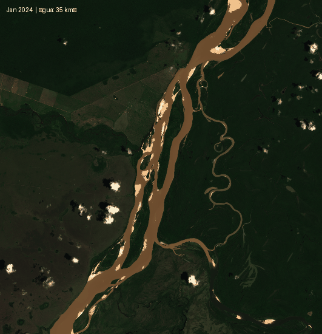
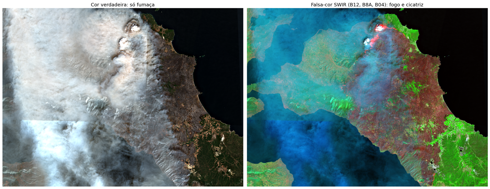
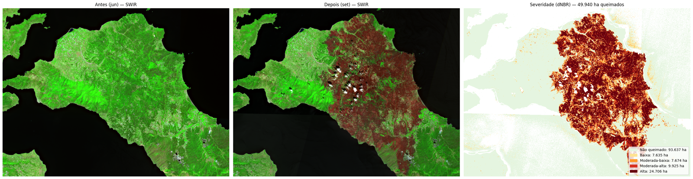
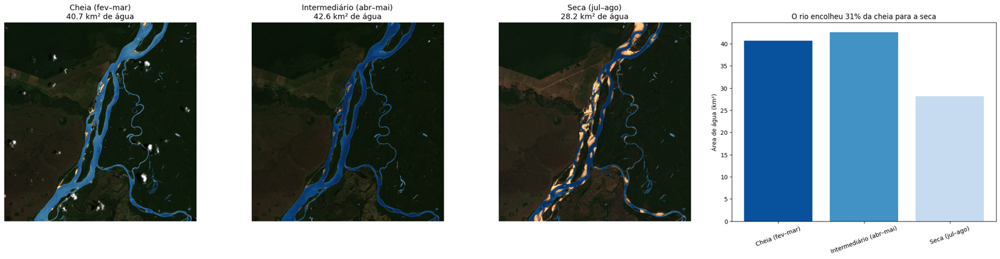
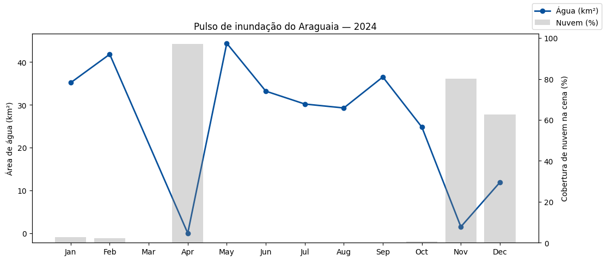
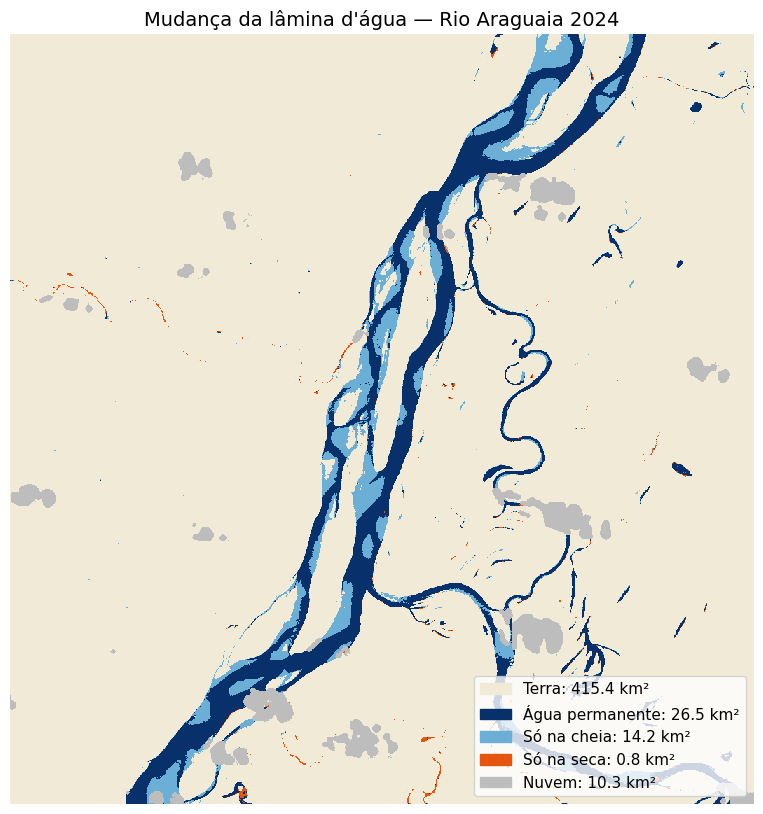
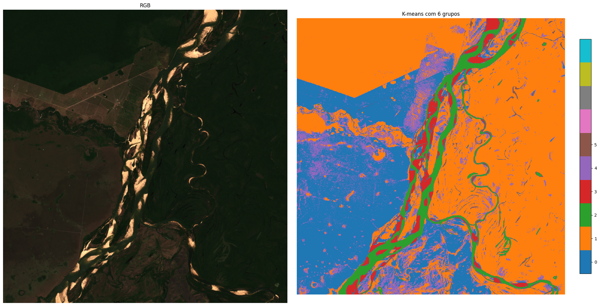

# 🛰️ Monitoramento de água e fogo com Sentinel-2

Análise de imagens de satélite **Sentinel-2** em Python, consumindo diretamente a **API do Copernicus Data Space**:
do download da imagem ao resultado em **km² e hectares**.

O material foi desenvolvido para o minicurso **[Introdução ao Sensoriamento Remoto com o Sentinel-2: como obter e utilizar imagens de satélite]** (WSIS, 10/2026).

## 👤 Autores

**Rayson Teodoro do Carmo** — [GitHub](https://github.com/theooray)

**Ana Clara Lima Moreira** —  [GitHub](https://github.com/nana28ac))

  

---

## 🔥 Destaque: área queimada no incêndio da Eubeia (Grécia, ago/2021)

A composição falsa-cor SWIR **enxerga através da fumaça** e mostra as frentes de fogo ativas:

Comparando o índice NBR antes e depois do fogo (**dNBR**), o notebook calculou **≈ 49.900 ha queimados**.
As estimativas oficiais divulgadas na época foram de **≈ 51.000 ha**: uma diferença de cerca de 2%, que valida o método.

## 🌊 O pulso de inundação do Rio Araguaia (2024)

Com o **NDWI** e a máscara de nuvens da banda SCL, cada imagem vira um número: quantos km² de água o rio tem em cada época.

Uma série mensal mostra o pulso do rio ao longo do ano e também **como as nuvens distorcem a análise**.
Os meses com muita nuvem (barras cinzas) aparecem com área de água artificialmente baixa.

| Mapa de mudança cheia × seca | Classificação não supervisionada (K-means) |
|---|---|
|  |  |

---

## 📚 Conteúdo do notebook

**Parte 1 — Fundamentos**
- Autenticação OAuth2 e renovação automática do token
- Anatomia de uma requisição à Process API (onde, quando, o quê e tamanho)
- Evalscripts: como escrever a "receita" de cada pixel em JavaScript
- `AUTO` × `FLOAT32`: imagem para **ver** × dado para **calcular**
- Filtros de nuvem, escolha de cena (`mosaickingOrder`) e resolução espacial

**Parte 2 — Exemplos práticos**
| # | Exemplo | Técnicas |
|---|---|---|
| 1 | Quanto de água o rio perdeu? | NDWI, máscara de nuvem (SCL), pixels → km² |
| 2 | Limiar interativo | ipywidgets, incerteza na classificação |
| 3 | Mapa de mudança cheia × seca | Álgebra de mapas, mapa interativo com folium |
| 4 | Pulso do rio: timelapse + série mensal | Série temporal, GIF animado |
| 5 | Caça ao fogo | Falsa-cor SWIR, NBR, dNBR, classes de severidade do USGS |
| 6 | Classificação automática | K-means (scikit-learn) |
| 7 | Sua cidade | NDVI, comparação entre anos |

## 🛠️ Tecnologias

`Python` · `NumPy` · `Matplotlib` · `scikit-learn` · `folium` · `ipywidgets` · `requests-oauthlib` · `tifffile` · `Pillow`
**Dados:** Sentinel-2 L2A via [Copernicus Data Space Ecosystem](https://dataspace.copernicus.eu) (Sentinel Hub Process API)

## ▶️ Como executar

1. Crie uma conta gratuita no [Copernicus Data Space](https://dataspace.copernicus.eu) e gere um **OAuth client**
   em *User Settings → OAuth clients*.
2. Abra o notebook no Colab pelo botão acima.
3. Em **🔑 Secrets** (barra lateral do Colab), salve as credenciais com os nomes `id` e `secret`.
4. Execute as células em ordem.

As credenciais **não ficam no código**: são lidas dos Secrets do Colab ou de variáveis de ambiente.

> Para analisar outro rio, basta trocar `BBOX` e `PERIODOS` no início da Parte 2.
> Lembre que a API usa **longitude primeiro** e que cada rio tem a sua própria época de cheia e de seca.

